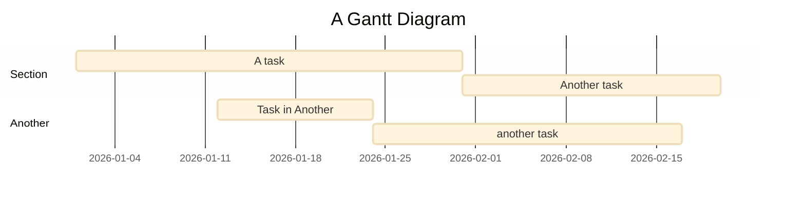

Use mermaid to visualise your project timelines - e.g. a Gantt Chart as seen below:

```mermaid  
%%{init: {'theme': 'base', 'themeVariables': { 'fontSize': '16px' } } }%%
gantt
    title A Gantt Diagram
    dateFormat YYYY-MM-DD
    section Section
        A task          :a1, 2026-01-01, 30d
        Another task    :after a1, 20d
    section Another
        Task in Another :2026-01-12, 12d
        another task    :24d
```